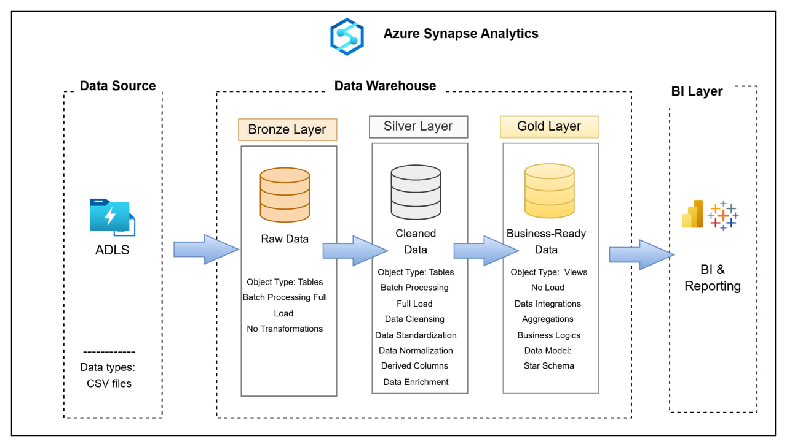
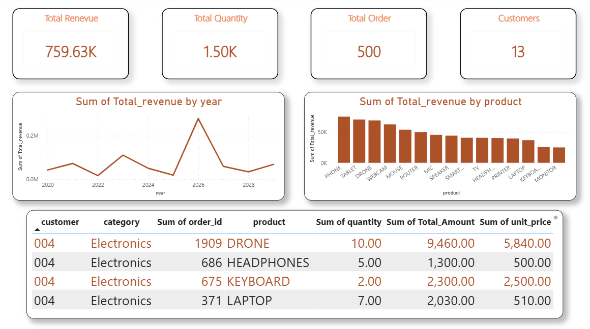

# Azure Synapse Analytics — End-to-End Sales Data Pipeline

A complete data engineering project that ingests raw sales data, transforms it through a **Medallion Architecture** (Bronze → Silver → Gold), and delivers business insights via a **Power BI dashboard**.

---

## Architecture



The pipeline is built entirely on **Azure Synapse Analytics** and follows three layers:

| Layer | Object Type | Purpose |
|-------|-------------|---------|
| **Bronze** | Tables | Raw ingestion from ADLS Gen2 — no transformations, all `VARCHAR` |
| **Silver** | Tables | Data cleansing, type casting, null handling, standardization |
| **Gold** | Views | Aggregations and business-ready data for reporting |

---

## Tech Stack

- **Azure Data Lake Storage Gen2 (ADLS)** — raw CSV file storage
- **Azure Synapse Analytics** — SQL-based data warehouse and transformation engine
- **Power BI** — dashboard and reporting layer

---

## Data Pipeline

### 1. Bronze Layer — Raw Ingestion (`sql/01_bronze.sql`)

Loads the CSV file from ADLS into a raw table using `COPY INTO`. All columns are stored as `VARCHAR` with no transformations to preserve the original data.

```sql
COPY INTO bronze.sales
FROM 'https://<storage>.dfs.core.windows.net/datalake/sales.csv'
WITH (file_type = 'CSV', firstrow = 2, fieldterminator = ',')
```

### 2. Silver Layer — Data Cleansing (`sql/02_silver.sql`)

Transforms raw data into a clean, typed table. Key transformations applied:

- **`order_id`** — cast from `VARCHAR` to `INT`
- **`order_date`** — safe date conversion using `TRY_CONVERT`; nulls defaulted to `'01-10-2026'`
- **`customer` / `product`** — trimmed, uppercased, and null-replaced with `'UNKNOWN'`
- **`category`** — standardized to `'Electronics'` across all rows
- **`quantity` / `unit_price`** — converted to `FLOAT`, negative values made absolute with `ABS()`
- **`Total_Amount`** — recalculated as `unit_price × quantity` to fix data inconsistencies

### 3. Gold Layer — Business Views (`sql/03_gold.sql`)

Creates views consumed directly by Power BI:

| View | Description |
|------|-------------|
| `gold.vu_sales` | Full sales fact table with a derived `year` column |
| `gold.kpis` | Aggregate KPIs: total revenue, orders, quantity, customers |
| `gold.sales_per_year` | Revenue grouped by year |
| `gold.sales_per_customer` | Revenue grouped by customer |
| `gold.sales_per_product` | Revenue grouped by product (excludes `UNKNOWN`) |

---

## Power BI Dashboard



### KPIs

| Metric | Value |
|--------|-------|
| Total Revenue | 759.63K |
| Total Quantity | 1.50K |
| Total Orders | 500 |
| Total Customers | 13 |

### Visuals

- **Line chart** — Total revenue trend by year
- **Bar chart** — Revenue breakdown by product (Phone, Tablet, Drone, Webcam, etc.)
- **Detail table** — Customer-level breakdown by product, quantity, and amount

---

## Repository Structure

```
├── images/
│   ├── architecture.jpg       # Pipeline architecture diagram
│   └── dashboard.png          # Power BI dashboard screenshot
├── data/
│   └── sales.csv              # Source dataset
├── sql/
│   ├── 01_bronze.sql          # Raw ingestion layer
│   ├── 02_silver.sql          # Cleansing and transformation layer
│   └── 03_gold.sql            # Business-ready views
└── README.md
```

---

## How to Reproduce

1. **Upload** `data/sales.csv` to your ADLS Gen2 container.
2. **Open** Azure Synapse Analytics Studio and create a dedicated SQL pool.
3. **Run the SQL scripts in order:**
   ```
   sql/01_bronze.sql  →  sql/02_silver.sql  →  sql/03_gold.sql
   ```
4. **Connect Power BI** to the Synapse SQL endpoint and import the `gold.*` views.
5. Build or import the dashboard using the provided screenshot as reference.

---

## Dataset

The `sales.csv` dataset contains electronics sales records with the following columns:

`order_id` | `order_date` | `customer` | `product` | `category` | `quantity` | `unit_price` | `Total_Amount`
